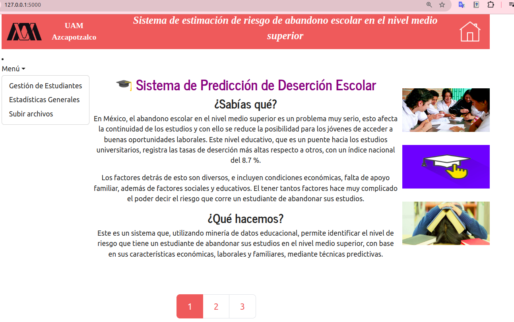
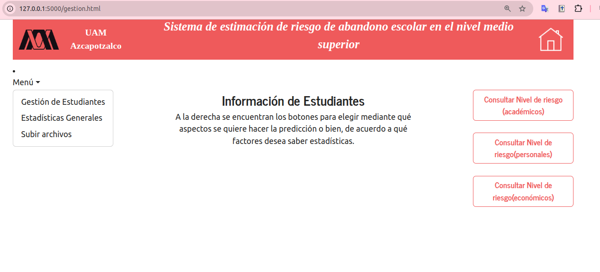
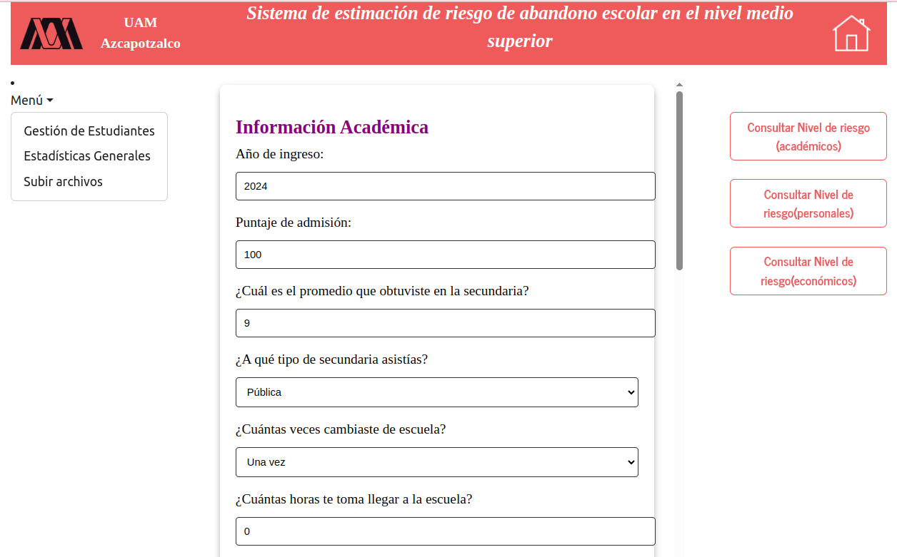
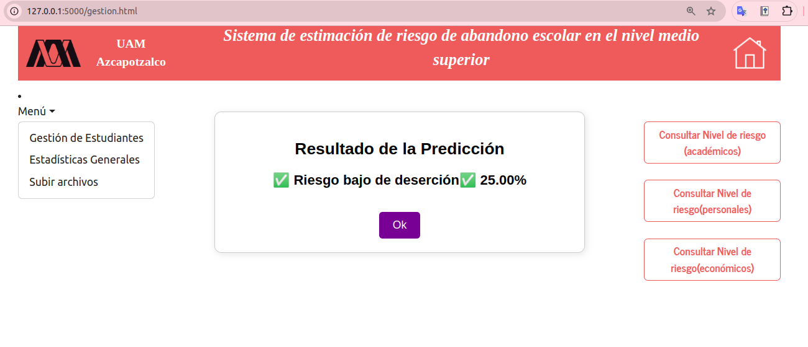
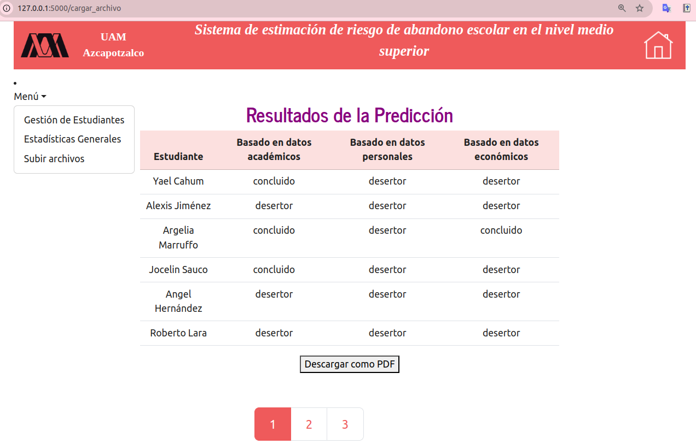

# Sistema Predictivo de Deserción Escolar

Este proyecto tiene como objetivo desarrollar un sistema predictivo capaz de identificar el riesgo de deserción escolar de estudiantes de nivel medio superior en México, utilizando técnicas de minería de datos educacional.

##  Descripción

La deserción escolar es un problema crítico en el sistema educativo mexicano, especialmente en el nivel medio superior. Este proyecto aplica técnicas de análisis de datos y modelos predictivos para detectar posibles casos de abandono escolar, basándose en características académicas, económicas y familiares de los estudiantes.

##  Objetivos

### Objetivo General
Desarrollar un sistema predictivo para identificar el riesgo de deserción escolar en estudiantes de nivel medio superior en México.

### Objetivos Específicos
1. Recopilar y procesar datos educativos relevantes.
2. Desarrollar modelos predictivos utilizando minería de datos.
3. Implementar una interfaz para la evaluación y visualización del riesgo de deserción.

##  Estructura del Sistema

El sistema se divide en tres módulos principales:

### 1. Ingreso y limpieza de datos
Carga y procesamiento de datos académicos, personales y socioeconómicos, los cuales se almacenan en una base de datos PostgreSQL.

### 2. Generación de modelos
Creación de modelos de Árbol de Decisión que evalúan distintos factores (académicos, económicos, personales/familiares y todos combinados).

### 3. Evaluación de estudiantes
Permite la evaluación de nuevos casos, ya sea individuales o masivos, y muestra el nivel de riesgo de deserción escolar.

## 🛠 Tecnologías Utilizadas

- Python
- Flask
- Pandas, NumPy
- Scikit-learn
- MySQL
- HTML, CSS

##  Fuentes de Datos

Los datos utilizados provienen de la **Encuesta Nacional de Deserción Escolar en Nivel Medio Superior**, proporcionados por el asesor del proyecto.

##  Criterios de Finalización

- Subida y procesamiento de datos mediante el módulo correspondiente.
- Generación de modelos predictivos con una eficiencia mínima del 85%.
- Evaluación individual o grupal de estudiantes desde una interfaz funcional.

##  Licencia

Este proyecto está protegido. No está permitido su uso o reproducción sin autorización expresa. Si deseas más información, por favor contacta al autor.

##  Autor
**Isthar Cahum Marruffo**  
Ingeniería en Computación - UAM Azcapotzalco  
Email: [istharcahummarruffo@gmail.com]

##  Capturas de Pantalla

### Página de Inicio

### Gestión de estudiantes

### Evaluación de estudiantes (caso individual, datos académicos)

### Evaluación de estudiantes (carga masiva)

### Resultados de predicción

### Resultados de predicción masiva

### Resultados de predicción masiva (PDF)

